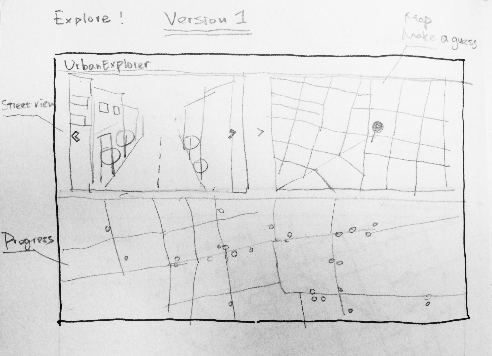
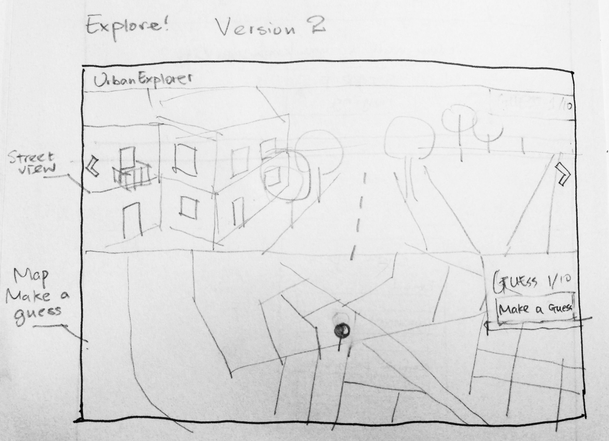
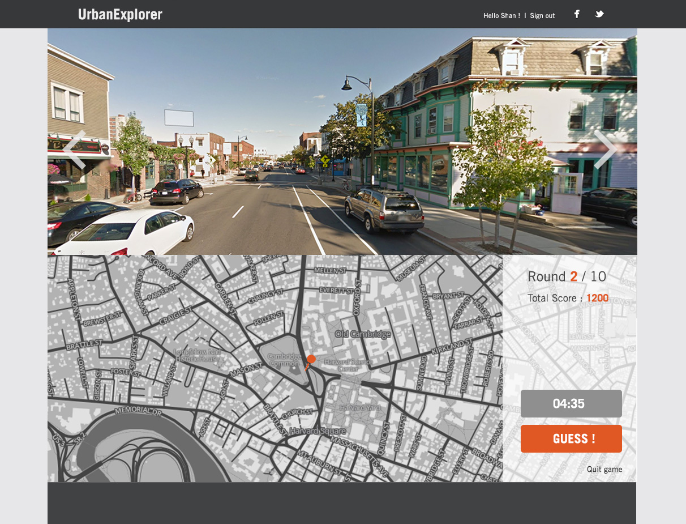
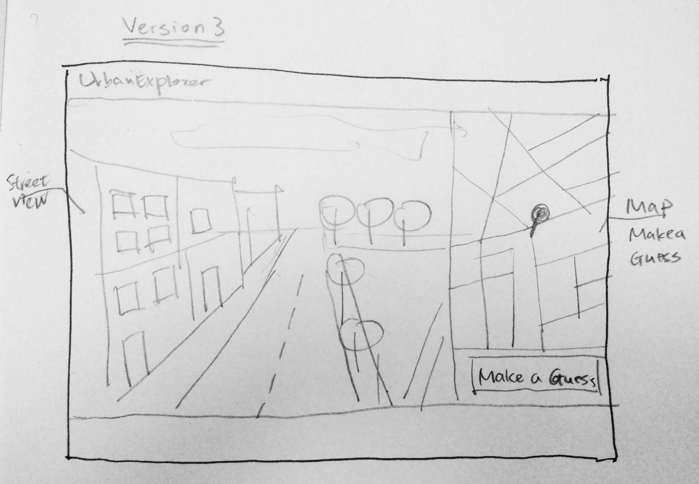

# Team UrbanExplorer

## 1: Did any of your answers to Milestone 1 change?
The only thing we really changed is that we decided to go with Meteor instead of Django, because we have a client-side heavy application for which we don't need all the logic on the server that Django provides. In addition, Meteor is very simple to deploy, saving us time.

## 2:   Which features are implemented. To what extent are they complete?
* Split screen for using street view & map: This is essentially our site, without it, we have nothing.
* Letting the user guess and then reveal the real location: The game aspect is central to our page.
* Keeping track of user's guesses: Login is required to keep track of guesses.

## 3:    Are there any features you wanted to include in your MVP from Milestone 1 that are not complete?
We were conservative when defining our MVP. All the MVPs features have been implemented, but they need more work to make the game more compelling and different from existing sites.

## 4:    What additional features do you wish to implement?
* Our own login and signup modals (The ones of Meteor aren't very pretty).
* A more flexible, more compelling UI. The current one works, but is not nice.
* An explanation/introduction page
* Buttons to share on fb, twitter.
* A scoring system and a way to play with/against friends.
* If all goes well, we'd like to extend the game to include Boston and Somerville.

## 5:    What technologies are you using for the back-end? Include any frameworks if relevant.
We are using Meteor and all the stuff that comes almost for free along with it, such as node.js and underscore

## 6:    What technologies are you using for the front-end?
We are using Meteor, and with it also handlebars, jQuery and underscore. We use 3rd party APIs of Google and mapbox for the street view images and the map.
 
## 7:    What is the main browser you are targeting?
We tested on Firefox and Chrome.

## 8:    What implementation unknown / risks are you still facing?
The biggest risk we see right now is that we don't manage to make the game compelling and work out the social component. As you have certainly noticed, at this point our game is not much more than a local version of Geoguessr. 

## User Research
1. Many folks don't really know the city they live in very well. We address this problem by helping people get familiar with the city they live in through a fun and challenging game. The game roughly works as follows: The user gets presented with a street-level picture from somewhere in the city and is asked to indicate on a map where the picture was taken. The more accurate the guess, the more points the user gets. The more points a user has, the higher his rank will be. Ranks are visible to others, thus encouraging users to compete with each other.
2. Our killer features are the gamification of urban exploration, along with an interface so simple that a three year-old could use it.
3. Our target demographic is anyone who would like to explore their city and get to know it better through a game, from children to seniors.
4. Use case

<table style="border: 1px solid black;">
    <tr><th>User</th><th>Site</th></tr>
    <tr><td></td><td>present a street-level panorama picture and map</td></tr>
    <tr><td>drag with mouse to rotate view</td><td></td></tr>
    <tr><td>recognize features in picture</td><td></td></tr>
    <tr><td>study map</td><td></td></tr>
    <tr><td>make educated guess about location by clicking on map</td><td></td></tr>
    <tr><td></td><td>reveal real location to user</td></tr>
    <tr><td>User explores street view from real and guessed location</td><td></td></tr>
    <tr><td>User clicks "next challenge"</td><td></td></tr>
    <tr><td>...</td><td></td></tr>
    <tr><td>User clicks "overview"</td><td></td></tr>
    <tr><td></td><td>Present map with visualization of areas the user knows well/not well</td></tr>
    <tr><td>User leaves site, happy about progress made</td><td></td></tr>
</table>

## Site Design
### Design 1

####Pros:
* User can see everything on one page, only one layout to get familiar with
* Simplifies design 
* User might get confused between map and progress view

####Cons:
* Map may be too small
* Street view may be too small
* Progress view is unecessary distraction

### Design 2

####Pros:
* Plenty of space for street view and map view
* Enough space for additional toggles, if needed
* No cluttering of screen, only essentials are shown

####Cons:
* Progress needs to be shown on another page
* Notifications have to be shown in an overlay
* Screen may not be tall enough, making map and street view too narrow.

### Design 3

####Pros:
* Plenty of space for street view
* Map can be 'minimized' (disappears to side)
* Extra space at bottom for additional UI elements

####Cons:
* Street view is wide, while map view is high. Looks somewhat ugly.
* Too much space at bottom, don't know what to do with it.
* Progress needs to be shown in separate page. 

## MVP
1. Core features
    * Split screen for using street view & map: This is essentially our site, without it, we have nothing.
    * Letting the user guess and then reveal the real location: The game aspect is central to our page.
    * Keeping track of user's guesses: Login is required for the competition.
2. Optional features
    * A scoring system for guesses: Could encourage competition, but is not essential
    * Visualization of the areas user knows well vs. areas he doesn't know well: This will be interesting to the user and might be an important part of the site, but it's not absolutely essential.
    * Ranks and medals: Could encourage playing, not essential
    * Sharing on facebook and comparing with friends: It's always nice to be social, but the site would also work without it.

3. Other reduced features
    * The MVP will only contain a minimal fake dataset with user's guesses

## Additional Questions

1. Team Members 
    * Shan He, shanhe@mit.edu, Architecture, Y2 graduate, for credit
    * Jonas Helfer, helfer@mit.edu, EECS, Y2 graduate, for credit
2. Theme 1
3. Django
4. Risks
    * Google's map/street view API might not allow us to restrict the user interface in the way we want.
    * The user experience might not be as good as we want, thus making the game less fun and ultimately useless.
    * Visualizing the user's progress on the map could be challenging
    * It could be nontrivial to come up with a meaningful scoring system 
5. Yes, for now.
